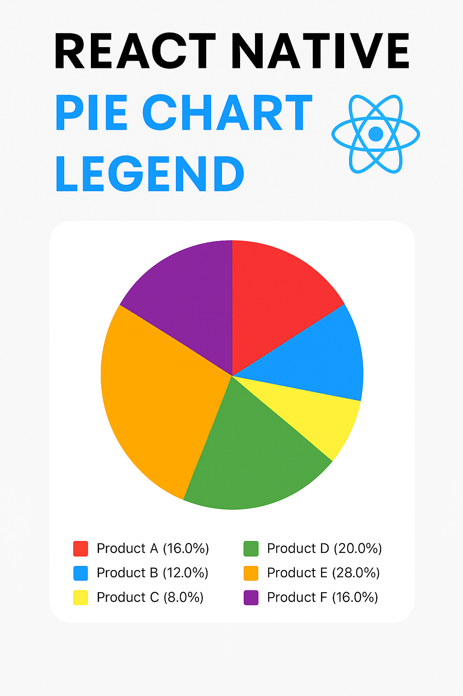

# react-native-pie-chart-legend

🎉 A **flexible, customizable and easy-to-use Pie Chart component with legend** for React Native — built with **zero dependencies** except `react-native-svg`.  
Perfect for **Expo** and **React Native CLI** apps.

---

## 🚀 Installation

```bash
npm install react-native-pie-chart-legend react-native-svg
# or
yarn add react-native-pie-chart-legend react-native-svg
```

---

## 🎥 Demo



---

## 💡 Usage

```tsx
import React from "react";
import { View } from "react-native";
import { PieChartLegend } from "react-native-pie-chart-legend";

const data = [
  { label: "Product A", value: 40 },
  { label: "Product B", value: 30 },
  { label: "Product C", value: 20 },
  { label: "Product D", value: 50 },
  { label: "Product E", value: 40 },
  { label: "Product F", value: 50 },
];

export default function App() {
  return (
    <View style={{ flex: 1, justifyContent: "center", alignItems: "center" }}>
      <PieChartLegend
        size={250}
        data={data}
        maxLabelLength={10}
        showPercentage={true}
        defaultColors={[
          "#F44336",
          "#2196F3",
          "#FFEB3B",
          "#4CAF50",
          "#FF9800",
          "#9C27B0",
          "#00BCD4",
        ]} // default
        containerStyle={{
          backgroundColor: "#fff",
          padding: 10,
          borderRadius: 10,
        }}
        legendStyle={{ marginTop: 30 }}
        //legendTextStyle={{ fontSize: 14, color: "#000" }}
        // legendItemStyle={{ marginVertical: 8 }}
        // colorBoxLegendStyle={{ width: 20, height: 20, borderRadius: 4 }}
      />
    </View>
  );
}
```

✅ This makes your pie chart fully customizable and fully styled according to your needs.

---

## 📐 Props

| Prop                  | Type                   | Default     | Description                                     |
| --------------------- | ---------------------- | ----------- | ----------------------------------------------- |
| `size`                | `number`               | `200`       | Diameter of the pie chart                       |
| `data`                | `IPieChartData[]`      | —           | The data array to render in the chart           |
| `defaultColors`       | `string[]`             | color set   | Fallback colors when no color is provided       |
| `containerStyle`      | `StyleProp<ViewStyle>` | `undefined` | Style for the container view                    |
| `legendStyle`         | `StyleProp<ViewStyle>` | `undefined` | Style for the full legend container             |
| `legendTextStyle`     | `StyleProp<TextStyle>` | `undefined` | Style for legend text labels                    |
| `legendItemStyle`     | `StyleProp<ViewStyle>` | `undefined` | Style for each individual legend row            |
| `colorBoxLegendStyle` | `StyleProp<ViewStyle>` | `undefined` | Style for the color box in the legend           |
| `showPercentage`      | `boolean`              | `true`      | Show percentages next to labels                 |
| `maxLabelLength`      | `number`               | `undefined` | Limit label length and append `...` if exceeded |

---

## 🧩 Features

- 📊 Clean and simple pie chart for React Native.
- 🎨 Fully customizable colors, styles and legends.
- ✂️ Optional label truncation with `maxLabelLength`.
- 📐 Flexible layout with 2-column legend.
- ⚡ Built with only `react-native-svg`, no extra dependencies.
- 💯 Perfectly works with both Expo and React Native CLI projects.
- 🧩 Zero extra configuration, ready to use out of the box.
- 📦 Lightweight package.

---

## 📦 License

MIT © [Jean Francois Moril](https://github.com/jeanmo333)

---

## 🔗 Links

- 📘 GitHub: [github.com/jeanmo333/react-native-pie-chart-legend](https://github.com/jeanmo333/react-native-pie-chart-legend)
- 📦 NPM: [npmjs.com/package/react-native-pie-chart-legend](https://www.npmjs.com/package/react-native-pie-chart-legend)
